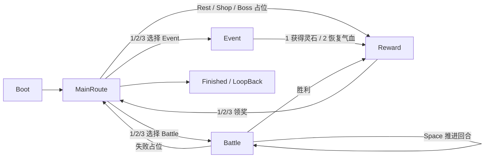

# Phase82 Cultivation 最小游戏流程闭环交付说�?
## 1. 本轮目标

本轮目标是优先跑�?Cultivation / 修仙养成原型的最小游戏流程闭环，而不是继�?UI 美化、Phase81 自动验收工具或旧肉鸽内容恢复�?
目标闭环�?
```text
启动游戏
-> 进入修仙主路线界�?-> 显示当前路线节点
-> 选择路线节点
-> 进入事件或战�?-> 战斗用最小模拟逻辑完成
-> 战斗结束进入奖励
-> 领取奖励
-> 返回路线界面
-> 推进 day / nodeIndex
-> Console �?Error
```

## 2. 当前流程�?


## 3. 新增 / 修改文件列表

新增�?
- `UnityProject/Assets/GameScripts/HotFix/GameLogic/Cultivation/Flow/CultivationFlowState.cs`
- `UnityProject/Assets/GameScripts/HotFix/GameLogic/Cultivation/Flow/CultivationRouteNodeType.cs`
- `UnityProject/Assets/GameScripts/HotFix/GameLogic/Cultivation/Flow/CultivationRouteNodeRuntimeData.cs`
- `UnityProject/Assets/GameScripts/HotFix/GameLogic/Cultivation/Flow/CultivationRouteRuntimeData.cs`
- `UnityProject/Assets/GameScripts/HotFix/GameLogic/Cultivation/Flow/CultivationRouteViewModelFactory.cs`
- `UnityProject/Assets/GameScripts/HotFix/GameLogic/Cultivation/Flow/CultivationGameFlowController.cs`
- 对应 Unity `.meta` 文件
- `Doc/交付说明/Phase82_Cultivation_最小游戏流程闭�?md`

修改�?
- `UnityProject/Assets/GameScripts/GameEntry.cs`
- `UnityProject/Assets/GameScripts/HotFix/GameLogic/GameApp.cs`
- `UnityProject/Assets/GameScripts/HotFix/GameLogic/CultivationCardGame/CultivationRunUIService.cs`

## 4. 状态机说明

新增状态机入口�?
```csharp
CultivationRunUIService.OpenMinimalGameplayLoop()
```

它内部创建或复用�?
```csharp
CultivationGameFlowController.OpenOrCreate()
```

状态至少包含：

- `Boot`
- `MainRoute`
- `Event`
- `Battle`
- `Reward`
- `Finished`

运行时数据由 `CultivationRouteRuntimeData` 持有，包含：

- 当前层数 `Layer`
- 当前天数 `Day`
- 当前节点 `NodeIndex`
- 当前气血 `Hp`
- 当前灵力 `Spirit`
- 当前灵石 `SpiritStones`
- 当前卡组 `Deck`
- 当前可选路线节�?`AvailableNodes`

## 5. 操作方式

运行后可用键盘操作：

- `1 / 2 / 3`：在 MainRoute 选择�?1 / 2 / 3 个路线节点�?- `Event` 状态下�?  - `1`：获得灵石�?  - `2`：恢复气血�?- `Battle` 状态下�?  - `Space`：推进一回合模拟战斗�?- `Reward` 状态下�?  - `1`：获得灵石�?  - `2`：获得卡牌�?  - `3`：恢复气血�?
关键状态切换会输出 `[CultivationFlow]` 日志�?
## 6. 已跑通内�?
已实现并验证�?
- Editor 快速入�?`GameEntry` 默认进入最小流程�?- 正式热更入口 `GameApp.StartGameLogic()` 默认进入最小流程�?- MainRoute 使用 Phase79 当前视觉基线 `Steam_MainRoute_Restore.prefab`，并通过 `SteamMainRouteDemoBinder` 刷新运行时数据�?- 无可用运行时模板时，会创建最小文本兜底界面�?- `MainRoute -> Battle -> Reward -> MainRoute` 可跑通�?- 战斗采用固定伤害模拟�?  - 玩家每回合造成 14 伤害�?  - 敌人存活时造成 6 伤害�?  - 敌人 HP <= 0 进入 Reward�?  - 玩家失败不会卡死，保�?1 HP �?MainRoute�?- Reward 选择后更�?RuntimeData，并推进 `day` �?`nodeIndex`�?- Event 可通过 `1 / 2` 产生灵石或恢复气血，再进入 Reward�?- Rest / Shop / Boss 目前为占位路线，能进�?Reward �?Battle，不阻塞闭环�?
## 7. 未完成内�?
本轮未做�?
- 未做 UI 美化�?- 未重�?MainRoute 视觉�?- 未恢复旧肉鸽玩法、旧 UI Prefab、旧视觉资产�?- 未接完整卡牌 AI、敌�?AI、动画、音效、卡组构筑深度�?- 未改 Luban 生成链路�?- 未继续推�?Phase81 自动验收工具�?- 未修�?ProjectSettings�?- 未修�?Phase80 Runtime 生命周期修复�?
## 8. 验证结果

命令验证�?
```text
dotnet build UnityProject\UnityProject.sln --no-restore
结果：成功，0 Error。存在项目既�?warning�?```

```text
git diff --check
结果：通过�?```

Unity MCP 验证�?
- `refresh_unity` �?Console 当前 0 Error�?- 进入 Play Mode 成功�?- �?Play Mode 内使�?Unity MCP 临时代码等价驱动�?  - 重置 / 创建 `CultivationGameFlowController`
  - 选择第一个节�?  - 推进 3 次战斗回�?  - 进入 Reward
  - 选择卡牌奖励
  - 返回 MainRoute
- 返回摘要�?
```text
state=MainRoute;
afterBattle=Reward;
turns=3;
day=2;
nodeIndex=1;
deck=4;
stones=120;
hp=60
```

Console 流程日志包含�?
```text
[CultivationFlow] Boot -> MainRoute
[CultivationFlow] MainRoute select node: Battle
[CultivationFlow] Battle start
[CultivationFlow] Battle turn: playerHp=66 enemyHp=16
[CultivationFlow] Battle turn: playerHp=60 enemyHp=2
[CultivationFlow] Battle turn: playerHp=60 enemyHp=0
[CultivationFlow] Battle win
[CultivationFlow] Battle -> Reward
[CultivationFlow] Reward selected: Card
[CultivationFlow] Reward -> MainRoute
```

未伪造人工试�?PASS：本轮验证是 Unity MCP 自动进入 Play Mode，并用临时代码等价驱动状态机，不是人工键盘手感验收�?
## 9. 明确未修改范�?
本轮未提交也不应提交�?
- `Library`
- `Temp`
- `Logs`
- `obj`
- `.vs`
- `UserSettings`
- 旧菜单报�?- 大量无关 Prefab
- `ProjectSettings`
- 非本轮必要的 UI 美术资产
- Phase81 自动验收报告与未跟踪残留
