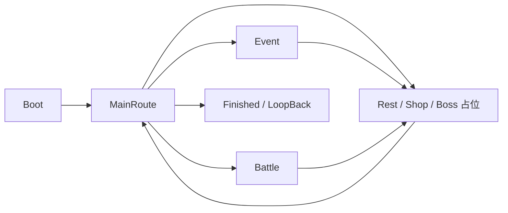

# Phase82 Cultivation 最小游戏流程闭环交付说明

## 1. 阶段目标

Phase82 的目标是优先跑通 Cultivation / 修仙养成原型的最小游戏流程，而不是继续 UI 美化、Phase81 自动验收工具或旧肉鸽内容恢复。

目标闭环：

```text
启动游戏
-> 进入修仙主路线界面
-> 显示并选择路线节点
-> 进入事件或占位战斗
-> 战斗结束进入奖励
-> 领取奖励
-> 返回路线界面
-> 推进 Day / NodeIndex
```

## 2. Phase82 状态机



状态枚举包括：

- `Boot`
- `MainRoute`
- `Event`
- `Battle`
- `Reward`
- `Finished`

## 3. 入口与运行数据

阶段入口：

```csharp
CultivationRunUIService.OpenMinimalGameplayLoop()
```

它创建或复用：

```csharp
CultivationGameFlowController.OpenOrCreate()
```

`CultivationRouteRuntimeData` 保存：

- 当前层数 `Layer`
- 当前天数 `Day`
- 当前节点 `NodeIndex`
- 气血 `Hp`
- 灵力 `Spirit`
- 灵石 `SpiritStones`
- 当前牌组 `Deck`
- 当前可选路线 `AvailableNodes`

## 4. 新增与修改文件

新增 Flow 层：

- `UnityProject/Assets/GameScripts/HotFix/GameLogic/Cultivation/Flow/CultivationFlowState.cs`
- `UnityProject/Assets/GameScripts/HotFix/GameLogic/Cultivation/Flow/CultivationRouteNodeType.cs`
- `UnityProject/Assets/GameScripts/HotFix/GameLogic/Cultivation/Flow/CultivationRouteNodeRuntimeData.cs`
- `UnityProject/Assets/GameScripts/HotFix/GameLogic/Cultivation/Flow/CultivationRouteRuntimeData.cs`
- `UnityProject/Assets/GameScripts/HotFix/GameLogic/Cultivation/Flow/CultivationRouteViewModelFactory.cs`
- `UnityProject/Assets/GameScripts/HotFix/GameLogic/Cultivation/Flow/CultivationGameFlowController.cs`

修改入口与服务：

- `UnityProject/Assets/GameScripts/GameEntry.cs`
- `UnityProject/Assets/GameScripts/HotFix/GameLogic/GameApp.cs`
- `UnityProject/Assets/GameScripts/HotFix/GameLogic/CultivationCardGame/CultivationRunUIService.cs`

## 5. Phase82 操作方式

- MainRoute：`1 / 2 / 3` 选择路线节点。
- Event：`1` 获得灵石，`2` 恢复气血。
- Battle：`Space` 推进占位战斗回合。
- Reward：`1` 灵石，`2` 卡牌，`3` 恢复气血。

关键切换使用 `[CultivationFlow]` 日志输出。

## 6. Phase82 已完成内容

- Editor 快速入口默认进入最小游戏流程。
- `GameApp.StartGameLogic()` 也调用同一入口。
- MainRoute 在 Editor 中使用 `Steam_MainRoute_Restore.prefab` 并通过 `SteamMainRouteDemoBinder` 刷新数据。
- 无可用模板时创建运行时文本兜底界面。
- `MainRoute -> Battle -> Reward -> MainRoute` 可以跑通。
- 占位战斗使用固定伤害：玩家每回合 14，敌人存活时反击 6。
- 奖励选择后更新运行数据并推进 Day 与 NodeIndex。
- Event、Rest、Shop、Boss 有不阻塞闭环的占位处理。

## 7. Phase82 明确未完成

- 没有接入真实 `BattleEngine` 手牌、灵力、敌人意图与卡牌操作。
- 没有把成熟的 `CultivationRunEngine` 作为唯一 Run 状态来源。
- 没有完成正式 Player 资源加载；非 Editor 构建仍使用运行时 fallback。
- 没有完成正式 UI、美术、动画、音效或手感。
- 没有迁移到 Luban 配置。
- 没有验证完整 `Procedure -> GameApp -> Cultivation` Player 链路。

这些缺口不能因为最小状态机可运行而视为完整游戏已经完成。

## 8. 当时验证记录

Phase82 提交 `99c4df9` 当时记录：

```text
dotnet build UnityProject\UnityProject.sln --no-restore
结果：0 Error

git diff --check
结果：通过
```

Unity MCP 以 CodeDom 反射驱动状态机得到：

```text
state=MainRoute;
afterBattle=Reward;
turns=3;
day=2;
nodeIndex=1;
deck=4;
stones=120;
hp=60
```

这证明的是 Phase82 占位状态机闭环，不是人工键盘手感、真实卡牌战斗或完整 Run 验收。

## 9. 后续状态说明

Phase83 已将完整产品方向锁定为《仙途·天命》，并开始修复生命周期验证与重复初始化。后续阶段必须优先合并 Phase82 占位流程和已有 `CultivationRunEngine + BattleEngine`，禁止继续扩展两套平行状态机。
