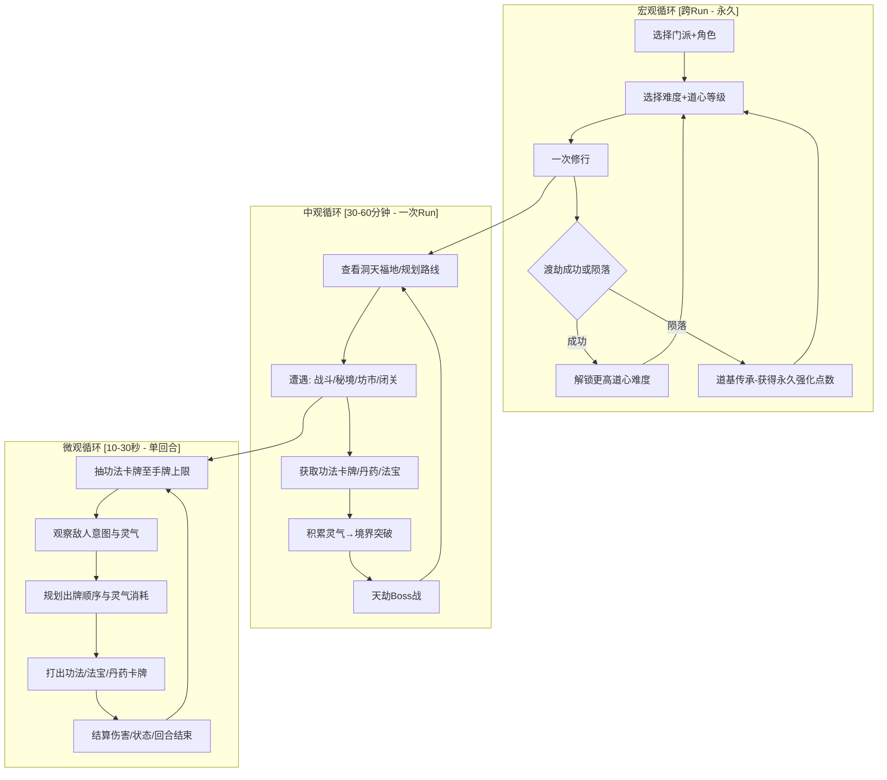
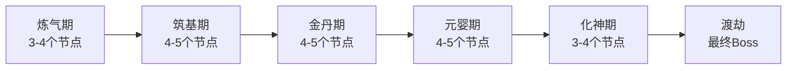

# 游戏设计文档 (GDD) — 仙途·天命

> **版本**：v0.2.0 · 设计深入阶段  
> **最后更新**：2025-06-18  
> **文档状态**：两个门派卡牌池+通用池+前两层敌人已完成 — 可开始纸面玩测试  
> 
> **配套文档**：
> - `/workspace/卡牌池设计_剑宗.md` — 剑宗28张专属卡牌
> - `/workspace/卡牌池设计_火云宗.md` — 火云宗27张专属卡牌
> - `/workspace/卡牌池设计_通用池与法宝.md` — 通用卡牌13张+法宝15件+丹药6颗+秘境12事件
> - `/workspace/敌人设计_炼气筑基期.md` — 炼气期8敌人+筑基期8敌人(含Boss)
> - `/workspace/平衡性调优表.xlsx` — 5个工作表的调优数据  

---

## 目录

1. [设计愿景](#1-设计愿景)
2. [核心游戏循环](#2-核心游戏循环)
3. [战斗系统详细设计](#3-战斗系统详细设计)
4. [卡牌系统](#4-卡牌系统)
5. [修仙主题系统](#5-修仙主题系统)
6. [Roguelite 进度系统](#6-roguelite-进度系统)
7. [经济与平衡设计](#7-经济与平衡设计)
8. [玩家引导设计](#8-玩家引导设计)
9. [技术实现建议](#9-技术实现建议)
10. [开发路线图](#10-开发路线图)

---

## 1. 设计愿景

### 1.1 核心概念

> **《仙途·天命》** — 一款东方玄幻题材的卡牌构筑 Roguelite。玩家扮演一位初入仙途的修士，在随机生成的修仙世界中收集功法卡牌、炼制丹药、突破境界、渡过天劫。每次 Run 都是一段从凡人到飞升的修行史诗，而每次失败都会为下一次修行留下永久的道基。

**一句话核心**：用卡牌模拟修仙者的功法组合与境界突破——构筑的不是牌组，是你的道。

### 1.2 设计支柱

| # | 支柱 | 含义 | 否决标准（不做什么） |
|---|------|------|---------------------|
| **P1** | **构筑即修行** | 牌组的构建过程本身就是修仙的隐喻：从散乱的基础功法到自成体系的完整道统 | 不做纯数值堆叠——每张卡牌必须有策略定位 |
| **P2** | **信息透明，决策有深度** | 敌人意图可见、牌库透明、概率可算；深度来自组合复杂度而非信息隐藏 | 不做盲猜式战斗——不隐藏影响决策的关键信息 |
| **P3** | **每次Run都有独特身份** | 程序化生成确保每次修行旅程的叙事弧线不同，玩家能自然地说出"那次金丹雷劫流" | 不做固定关卡——不做预设的线性流程 |
| **P4** | **成长感分层递进** | 单局内的境界突破 + 跨局的永久道基，提供即时的和长期的两种成长满足 | 不做纯粹重开——死亡后必须有可感知的永久积累 |
| **P5** | **复杂度渐进** | 前3次Run逐步解锁系统，避免信息过载；深度留给有追求的玩家去挖掘 | 不在前30分钟内展示所有系统 |

### 1.3 参考游戏分析

| 参考游戏 | 借鉴 | 舍弃 |
|----------|------|------|
| **Slay the Spire** | 敌人意图可见系统、3选1奖励、"跳过"机制、Ascension难度递进 | 西方奇幻世界观、无叙事Run结构、角色固定卡池 |
| **Monster Train** | 多层级战斗空间（道场/阵法层）、种族/阵营协同机制 | 塔防式战斗、天使恶魔世界观 |
| **杀戮尖塔Mod: Downfall** | Boss可玩角色思路→门派特色差异化 | — |
| **弈仙牌** | 修仙境界与卡牌关联、门派差异 | PvP导向、在线匹配 |
| **卡牌修仙传** | 修仙工作台概念、卡牌与炼器/炼丹的关联 | 过于模拟经营向、缺乏Roguelike核心循环 |
| **Holdfast** | 统一修饰器元组模型、蒙特卡洛模拟先行、定点整数运算 | 西方奇幻世界观、CT回合制 |

### 1.4 目标玩家画像

```
核心玩家：喜欢策略卡牌 + 修仙文化的 20-35 岁 Steam 用户
- 玩过 Slay the Spire / Monster Train / 杀戮尖塔，至少通关过 Normal 难度
- 对修仙文化有基础认知（看过修仙网文或玩过修仙游戏）
- 享受"我的流派很独特"的自我表达
- 平均单次游戏时长 30-60 分钟
- 有 "再来一局" 的冲动型行为模式
```

---

## 2. 核心游戏循环

### 2.1 三层循环总览



### 2.2 微观循环：单回合出牌

这是游戏最小粒度的决策单元，持续约 **10-30 秒**（新手期更长）。

**循环步骤**：

| 步骤 | 玩家行为 | 系统反馈 | 策略深度 |
|------|----------|----------|----------|
| 1. 抽牌 | 自动从功法牌库抽牌至手牌上限（默认5张） | 卡牌动画飞入手牌区 | 无决策，但触发"抽到时"效果 |
| 2. 观察 | 查看手牌、灵气量、敌人头顶意图图标 | 意图图标清晰显示下回合行为 | **核心决策准备**——已知威胁，评估应对能力 |
| 3. 决策 | 选择打出哪些牌、以什么顺序打出 | 高亮可选目标、显示预计算伤害 | **核心决策执行**——牌序是关键策略维度 |
| 4. 执行 | 逐张打出选定功法 | 即时视觉+音效反馈，伤害数字弹出 | 观察效果是否符合预期 |
| 5. 结束 | 点击"回合结束"或灵气耗尽自动结束 | 未用手牌进入弃牌堆，敌人执行行动 | 防御牌是否留到下回合？ |

**出牌顺序的策略深度**：

- **先破防再攻击**：先打"破甲符"（减防），再打"剑气诀"（造成伤害）→ 总伤害更高
- **先蓄力再爆发**：先打"聚灵术"（下回合+灵气），为下回合的"万剑归宗"（高费高伤）做准备
- **回合末留防御**：如果敌人下回合意图是大伤害攻击，优先保留"护体真气"而非用完所有灵气
- **触发功法协同**：先打"火系"功法触发"烈焰印记"，再用"焚天诀"消耗印记造成额外伤害

### 2.3 中观循环：一次Run（修行之旅）

一次完整的 Run 持续约 **30-60 分钟**，模拟从初入仙途到渡劫飞升的修行历程。

**Run 结构**：



**节点类型**（每层地图约15-20个节点，玩家选择路径前进）：

| 节点类型 | 出现频率 | 描述 | 核心决策 |
|----------|----------|------|----------|
| 🗡️ **普通战斗** | ~50% | 与修仙界妖兽/邪修/心魔战斗 | 选择战斗策略、评估风险收益 |
| 💀 **精英战斗** | ~12% | 与强大妖兽或敌对修士战斗 | **是否冒险挑战？** 高风险高回报 |
| 🏪 **坊市** | ~8% | 购买/出售功法、丹药、法宝 | 如何分配灵石？移除哪张牌？ |
| 🧘 **闭关** | ~10% | 恢复HP + 升级一张卡牌 | 恢复生命还是升级关键牌？ |
| 🌀 **秘境** | ~15% | 随机事件——奇遇、陷阱、交易 | 评估风险/收益权衡 |
| 🎁 **宝箱** | ~5% | 获得法宝（遗物） | 无决策，纯奖励 |

**路径选择**（中观循环的核心决策）：

- 地图在每次 Run 开始时**完全可见**，玩家可以预先规划路线
- 是否前期冒险打精英以获取强力法宝？
- 坊市路线可以优化牌组质量，但会跳过战斗的灵石和功法奖励
- 闭关节点是安全选择，但可能让牌组缺乏强度应对后续挑战

**境界突破机制**（见第5章详述）贯穿中观循环：每进入新的境界层，牌库上限+2、手牌上限+1、初始灵力+1，同时解锁更高级功法卡牌的出现资格。

### 2.4 宏观循环：跨Run（道基传承）

每次 Run 结束后，无论成功或失败，玩家获得**道基精华**（永久货币），可投入**道基树**解锁永久强化。

**循环驱动**：
```
完成一次Run → 获得道基精华（根据到达的境界层数）
  → 投入道基树解锁永久强化
  → 选择新角色/门派尝试不同策略
  → 在更高道心难度下挑战
  → 再次Run...
```

**核心心理钩子**：
1. **"差点就赢了"** — 在渡劫Boss以微弱差距陨落 → 强烈"再来一局"冲动
2. **"这次要走不同路线"** — 新解锁的门派/功法提供新鲜策略空间
3. **"道基积累让我更强"** — 每次Run都有可感知的永久成长

---

## 3. 战斗系统详细设计

### 3.1 战斗概览

```
┌─────────────────────────────────────────┐
│  敌人区域                                │
│  ┌─────┐  ┌─────┐  ┌─────┐             │
│  │妖兽A│  │妖兽B│  │邪修 │   ← 意图图标  │
│  └─────┘  └─────┘  └─────┘             │
│                                         │
│  ─────────── 战斗分界线 ───────────      │
│                                         │
│  玩家区域                               │
│  [HP: 85/100]  [灵力: 3/3]  [护盾: 5]   │
│  手牌: [剑诀][护体][破甲][焚天][聚灵]    │
│  牌库: 12张  弃牌堆: 3张  灵力池: 0     │
└─────────────────────────────────────────┘
```

### 3.2 核心资源系统

| 资源 | 初始值 | 每回合刷新 | 上限 | 设计意图 |
|------|--------|------------|------|----------|
| **灵力（LQ）** | 3 | 完全刷新 | 随境界提升+1/层 | 相当于"法力水晶"，是每回合的行动预算 |
| **生命（HP）** | 100 [PLACEHOLDER] | 不刷新（持久资源） | 随境界+体质成长 | Run内的生存指标，HP归零=陨落 |
| **护盾（Shield）** | 0 | 回合开始清0 | 无上限但不可叠加 | 临时的伤害缓冲，仅持续到回合开始 |
| **手牌上限** | 5 | 自动抽至上限 | 随境界+1/层 | 决策空间的宽度 |
| **牌库** | 初始12张 | — | 随境界+2/层 | 牌库越大，关键牌抽到概率越低 |

**灵力经济设计**：
- 灵力是 **每回合完全刷新** 的资源——"这回合不用完就浪费了"
- 灵力上限随境界提升增加（炼气3→筑基4→金丹5→元婴6→化神7）
- 设计意图：前期限制玩家单回合出牌数量，后期允许更复杂的combo
- **0费牌** 是稀缺设计资源，每张0费牌必须有明确的策略定位和代价

### 3.3 手牌管理

```
抽牌规则：
1. 回合开始时，从牌库顶抽牌至手牌上限
2. 牌库耗尽时，将弃牌堆洗入牌库（保留弃牌堆顺序）
3. 回合结束时，手牌中未打出的牌进入弃牌堆（不保留）
4. 战斗中 "保留" 关键词的牌可以留在手牌跨回合
```

**设计意图**：不保留手牌 = 每回合是独立的决策单元。玩家不能囤积关键牌等待"完美时机"，必须在当前回合用现有手牌做出最优决策。这避免了"等待combo"的无聊回合。

### 3.4 出牌规则

| 规则 | 详情 |
|------|------|
| **灵力消耗** | 每张牌消耗其灵力费用，灵力不足则无法打出 |
| **目标选择** | 单体攻击需点击目标敌人；全体攻击自动命中所有敌人；增益牌默认指向自身 |
| **出牌顺序** | 打出的牌按顺序解析，牌序影响最终效果（如先破防后攻击） |
| **回合内不限出牌数** | 只要灵力足够，可以打出任意数量的牌 |
| **法术吟唱** | 部分强力牌有"吟唱N回合"——打出后N回合才生效，期间占用一个手牌位 |

### 3.5 敌人AI与意图系统

**设计原则**：所有敌人意图**完全可见**——用图标+数字显示在下回合。

| 意图类型 | 图标 | 显示内容 | 策略含义 |
|----------|------|----------|----------|
| 攻击 | 🗡️ | 伤害数值 | "我需要多少护盾/要不要交防御牌？" |
| 防御 | 🛡️ | 护盾数值 | "这回合是输出窗口还是也要防御？" |
| 强化 | ⬆️ | 效果描述 | "必须打断/驱散，还是可以承受下回合的强化攻击？" |
| 召唤 | 📢 | 召唤物名称 | "先清召唤物还是rush本体？" |
| 特殊 | ❓ | 效果描述 | "未知但可预判——评估风险" |

**意图可见带来的策略深度**：
- 玩家不再"猜测"敌人行为，而是"规划"应对方案
- 深度来自 **"我手里这几张牌能不能应对这个已知威胁"** 的计算
- Boss战可以有更复杂的意图模式（如"第3回合必定释放毁天灭地"），让玩家提前准备

**敌人AI行为模式**（程序化生成敌人时从中选择）：

| AI模式 | 行为逻辑 | 克制策略 |
|--------|----------|----------|
| **激进型** | 70%攻击 / 20%强化 / 10%防御 | 需要持续护盾或高爆发rush |
| **防守型** | 40%防御 / 30%攻击 / 30%回复 | 需要破防/穿甲手段 |
| **控制型** | 40%debuff / 30%攻击 / 30%防御 | 需要净化/免疫手段 |
| **召唤型** | 50%召唤 / 30%攻击 / 20%防御 | 需要AOE清场能力 |

### 3.6 状态效果系统（基于修饰器元组）

采用统一修饰器元组模型，所有 buff/debuff 都用相同数据结构表达：

```json
{
  "stat": "HP | LQ | SHIELD | POWER | DEFENSE | DRAW | HAND_SIZE",
  "operation": "FLAT_ADD | FLAT_SUB | PCT_ADD | PCT_SUB | SET",
  "value": 3,
  "duration": 3,
  "stackable": false,
  "source": "card_id",
  "tags": ["fire", "dot"]
}
```

**核心状态效果**：

| 状态 | 修饰器定义 | 效果 | 策略影响 |
|------|-----------|------|----------|
| 🔥 **灼烧** | `{HP, FLAT_SUB, 3, 3}` | 每回合扣3HP，持续3回合 | 适合长战斗，总伤害高但慢 |
| ❄️ **冰冻** | `{LQ, FLAT_SUB, 1, 2}` | 下回合灵力-1，持续2回合 | 限制敌人出牌能力 |
| 🗡️ **破防** | `{DEFENSE, PCT_SUB, 50, 2}` | 防御力-50%，持续2回合 | 放大物理伤害的窗口期 |
| ⚡ **雷击** | `{HP, FLAT_SUB, 8, 0}` + 概率眩晕 | 即时8伤害+50%概率跳过敌人下回合 | 高方差控制手段 |
| 💪 **强化** | `{POWER, PCT_ADD, 25, 3}` | 攻击力+25%，持续3回合 | 爆发前的准备 |
| 🛡️ **护体** | `{SHIELD, FLAT_ADD, 10, 1}` | 获得10护盾（回合开始清0） | 单回合伤害缓冲 |
| ☠️ **中毒** | `{HP, FLAT_SUB, X, 99}` | 每回合扣X，X=中毒层数，不自动衰减 | 随时间指数增长，长战斗终结者 |
| 🔒 **封印** | `{HAND_SIZE, FLAT_SUB, 1, 2}` | 手牌上限-1，持续2回合 | 限制决策空间 |

**修饰器解析顺序**：
```
基础值 → 平坦修正（FLAT_ADD/SUB） → 百分比修正（PCT_ADD/SUB） → SET覆盖
```

**解析示例**（敌人防御力计算）：
```
基础防御: 20
  → 破防 (PCT_SUB 50%): 20 * 0.5 = 10
  → 虚弱 (FLAT_SUB 5): 10 - 5 = 5
最终防御: 5（受到的物理伤害减少5）
```

### 3.7 战斗完整时序

```
┌─ 战斗开始 ─────────────────────────────────────┐
│ 1. 初始化：洗牌牌库、抽至手牌上限、重置灵力   │
│ 2. 先手判定（速度属性比较，或固定玩家先手）    │
└────────────────────────────────────────────────┘
                      ↓
┌─ 每回合循环 ───────────────────────────────────┐
│ [回合开始]                                      │
│   a. 清除上回合护盾（护盾不跨回合）             │
│   b. 触发"回合开始时"效果（持续伤害/治疗等）    │
│   c. 检测死亡（中毒致死等）                      │
│   d. 灵力完全刷新                                │
│   e. 抽牌至手牌上限                              │
│                                                  │
│ [玩家行动阶段]                                   │
│   f. 玩家选择出牌（顺序自由）                    │
│   g. 每张牌即时解析效果                          │
│   h. 玩家点击"回合结束"或灵力耗尽自动结束        │
│                                                  │
│ [敌人行动阶段]                                   │
│   i. 敌人按意图执行行动                          │
│   j. 即时解析效果                                │
│                                                  │
│ [回合结束]                                       │
│   k. 触发"回合结束时"效果                        │
│   l. 未用手牌进入弃牌堆                          │
│   m. 检测死亡                                    │
│   n. 减益持续时间-1，到期效果移除                │
└──────────────────────────────────────────────────┘
                      ↓
        战斗结束（一方全灭或特殊条件）
```

---

## 4. 卡牌系统

### 4.1 卡牌分类体系

卡牌分为四大类，对应修仙世界的核心概念：

| 大类 | 子类 | 修仙概念 | 典型效果 | 灵力消耗范围 | 占比（卡池） |
|------|------|----------|----------|-------------|-------------|
| ⚔️ **功法** | 攻击功法 | 剑诀、掌法、雷法 | 造成伤害 | 1-4 | ~35% |
| | 防御功法 | 护体真气、金钟罩 | 获得护盾/增加防御 | 1-3 | ~15% |
| | 身法 | 轻功、瞬移 | 抽牌/闪避/额外回合 | 0-2 | ~10% |
| 💊 **丹药** | 回复丹药 | 回春丹、大还丹 | 恢复HP | 1-3 | ~8% |
| | 增益丹药 | 增元丹、破境丹 | 临时属性提升 | 1-3 | ~7% |
| 🔮 **法宝** | 攻击法宝 | 飞剑、雷印 | 特殊伤害效果 | 2-5 | ~10% |
| | 防御法宝 | 护心镜、避水珠 | 特殊防御效果 | 1-3 | ~5% |
| 📜 **秘术** | 禁术 | 天魔解体、血祭 | 强力效果+代价 | 0-3 | ~5% |
| | 阵法 | 五行阵、八卦阵 | 持续场地效果 | 2-4 | ~5% |

### 4.2 卡牌稀有度

| 稀有度 | 颜色 | 出现条件 | 强度基准 | 占卡池比例 |
|--------|------|----------|----------|------------|
| **凡品** | 白 | 炼气期起 | 基准强度 1.0x | 40% |
| **灵品** | 绿 | 筑基期起 | 1.3x 或同费用附加小效果 | 30% |
| **仙品** | 蓝 | 金丹期起 | 1.6x 或独特机制 | 18% |
| **圣品** | 紫 | 元婴期起 | 2.0x 或改变构筑方向 | 9% |
| **道品** | 金 | 化神期起 | 2.5x + Run定义级效果 | 3% |

**稀有度与境界解锁**：更高稀有度的卡牌仅在达到对应境界后的奖励池中出现，确保力量曲线与Run进程同步。

### 4.3 卡牌升级系统

每张卡牌可升级 **最多2次**。升级在"闭关"节点进行，每次升级从2个分支中选择1个。

**设计原则**（借鉴Holdfast）：
- 升级**添加效果**而非单纯缩放数值
- 灵力消耗减少与经济操控不同时出现
- 分支选择**情境依赖**——没有永远正确的升级选项

**升级分支示例**：

```
【剑气诀】凡品 · 攻击功法 · 1灵 · 造成8伤害
├─ 升级1A: 追魂剑气 → +3伤害（总计11）
├─ 升级1B: 灵动剑气 → 灵力消耗-1（变为0灵）
│
【追魂剑气】（从1A）
├─ 升级2A: 破魂剑气 → 附带1层破防（2回合）
├─ 升级2B: 连珠剑气 → 额外攻击1次（总伤变为2×8）
│
【灵动剑气】（从1B）
├─ 升级2C: 无影剑气 → 抽1张牌
├─ 升级2D: 寒冰剑气 → 附带1层冰冻
```

### 4.4 示例卡牌（15张）

#### 攻击功法

| # | 卡牌名 | 稀有度 | 灵力 | 效果 | 设计意图 |
|---|--------|--------|------|------|----------|
| 1 | **剑气诀** | 凡品 | 1 | 造成 8 伤害 | 基准攻击牌——衡量其他牌的标尺 |
| 2 | **破甲符** | 凡品 | 1 | 造成 3 伤害 + 施加1层破防(2回合) | 教你"先破防后攻击"的基础协同 |
| 3 | **焚天掌** | 灵品 | 2 | 造成 12 伤害 + 施加1层灼烧(3回合) | 火系入门——直接伤害+持续伤害 |
| 4 | **万剑归宗** | 仙品 | 4 | 造成 6×3 伤害（随机分配目标） | 高费高爆发——需要灵气规划 |
| 5 | **雷霆一击** | 圣品 | 3 | 造成 20 伤害 + 50%概率眩晕敌人1回合 | 高方差终结技 |

#### 防御功法

| # | 卡牌名 | 稀有度 | 灵力 | 效果 | 设计意图 |
|---|--------|--------|------|------|----------|
| 6 | **护体真气** | 凡品 | 1 | 获得 8 护盾 | 基准防御牌 |
| 7 | **金钟罩** | 灵品 | 2 | 获得 12 护盾 + 本回合防御+3 | 专门克制高伤害攻击 |

#### 丹药

| # | 卡牌名 | 稀有度 | 灵力 | 效果 | 设计意图 |
|---|--------|--------|------|------|----------|
| 8 | **回春丹** | 凡品 | 1 | 恢复 6 HP | 基准回复——让玩家知道HP是可回复资源 |
| 9 | **增元丹** | 灵品 | 1 | 本回合灵力+2 | 爆发回合引擎——允许打出超预算combo |

#### 法宝

| # | 卡牌名 | 稀有度 | 灵力 | 效果 | 设计意图 |
|---|--------|--------|------|------|----------|
| 10 | **青冥飞剑** | 灵品 | 2 | 造成 10 伤害 + 如果目标有破防，伤害翻倍 | 协同奖励——激励破防构筑 |
| 11 | **五行法阵** | 仙品 | 3 | 持续3回合：每回合开始对全体敌人造成3伤害 | 长战斗价值——随时间累积收益 |

#### 身法

| # | 卡牌名 | 稀有度 | 灵力 | 效果 | 设计意图 |
|---|--------|--------|------|------|----------|
| 12 | **轻身术** | 凡品 | 0 | 抽2张牌 | 牌库循环加速——0费但消耗手牌位 |
| 13 | **幻影步** | 灵品 | 1 | 本回合获得2次闪避（完全免疫2次伤害） | 高风险回合的救命牌 |

#### 秘术

| # | 卡牌名 | 稀有度 | 灵力 | 效果 | 设计意图 |
|---|--------|--------|------|------|----------|
| 14 | **天魔解体** | 圣品 | 0 | 失去10HP，本回合灵力+3、力量翻倍 | 高风险高回报——"绝境翻盘"幻想 |
| 15 | **道心种魔** | 道品 | 5 | 对所有敌人施加5层中毒。消耗（本Run永久移除此牌） | Run终结者——一次性使用，但效果足以终结任何战斗 |

### 4.5 卡牌获取机制

| 获取方式 | 频率 | 选项数 | "跳过"可用？ | 设计意图 |
|----------|------|--------|-------------|----------|
| **战斗胜利** | 每场普通/精英战斗 | 3选1 | ✅ 可以跳过 | 主要卡牌来源。跳过是高级策略——精简牌库 > 臃肿牌库 |
| **坊市购买** | 每次坊市节点 | 5-8张可选 | ✅ 可不买 | 灵石有限，选择性购买 |
| **秘境事件** | 随机 | 不定 | 视事件而定 | 高风险事件可能给稀有牌 |
| **Boss奖励** | 每层Boss | 3选1（稀有度+1） | ❌ 必须选 | Boss奖励品质保证，是构筑方向的重要转折点 |
| **初始牌组** | Run开始时 | 固定12张 | — | 每门派不同的初始功法组合 |

**"跳过"机制**：借鉴《杀戮尖塔》，跳过率目标为 **30-50%**（高水平玩家应主动跳过近半数奖励）。这是游戏教给玩家的重要课程——"少即是多"。

---

## 5. 修仙主题系统

### 5.1 境界突破机制

境界是Run内玩家的核心成长轴。每次境界突破提供**即时永久加成**并解锁新卡牌池。

| 境界 | 所在层 | 突破条件 | 突破奖励 |
|------|--------|----------|----------|
| **炼气期** | 第1层 | 初始境界 | 灵力3、手牌上限5、牌库上限15 |
| **筑基期** | 第2层 | 击败第1层Boss | 灵力+1、手牌上限+1、牌库上限+2、解锁灵品卡牌 |
| **金丹期** | 第3层 | 击败第2层Boss | 灵力+1、手牌上限+1、牌库上限+2、解锁仙品卡牌、获得1个金丹被动 |
| **元婴期** | 第4层 | 击败第3层Boss | 灵力+1、手牌上限+1、牌库上限+2、解锁圣品卡牌、获得元婴出窍能力 |
| **化神期** | 第5层 | 击败第4层Boss | 灵力+1、手牌上限+1、牌库上限+2、解锁道品卡牌、神魂强化 |
| **渡劫飞升** | 最终 | 击败天劫Boss | **Run通关！** |

**境界突破体验设计**：
- 每次突破有短暂的动画+音效高潮——"突破壁障"的快感
- 境界名称在UI顶部醒目位置显示——持续的身份标识
- 突破后第一场战斗有额外灵力加成——让你立刻感受变强的快感

### 5.2 金丹被动

金丹期突破时，玩家从**3个随机金丹被动**中选择1个（Roguelite式三选一）：

| 金丹被动 | 效果 | 构筑方向 |
|----------|------|----------|
| 🔥 **火灵根** | 火系功法伤害+25% | 火系灼烧流 |
| ❄️ **冰灵根** | 冰系功法额外施加1层冰冻 | 控制流 |
| ⚡ **雷灵根** | 每打出第4张功法，造成5点雷电伤害 | 高频出牌流 |
| 🗡️ **剑心通明** | 攻击功法灵力消耗-1（最低1） | 攻击压制流 |
| 🛡️ **不灭金身** | 每场战斗首次受伤时，获得10护盾 | 防御反击流 |
| 💀 **毒体** | 中毒伤害+50% | 毒系堆积流 |

### 5.3 功法体系

功法卡牌按**五行属性**分类，同一属性的功法之间具有**属性协同**：

| 五行 | 核心机制 | 协同关键词 | 代表卡牌 |
|------|----------|------------|----------|
| 🔥 **火** | 高直伤+灼烧 | "烈焰印记"——叠满3层引爆 | 焚天掌、烈火诀 |
| 💧 **水** | 控制+回复 | "流水之势"——每回合额外抽1 | 寒冰掌、甘霖术 |
| 🌿 **木** | 中毒+成长 | "生生不息"——每回合HP恢复 | 毒藤术、回春功 |
| ⛰️ **土** | 护盾+防御 | "大地之力"——护盾可叠加 | 金钟罩、岩甲术 |
| ⚡ **金** | 暴击+穿透 | "锐金之气"——无视防御 | 破甲符、剑气诀 |

**多属性构筑**：玩家可以混搭不同属性的功法，但单一属性深度构筑通常更强——这是风险/收益权衡。

### 5.4 丹药系统

丹药是一种**消耗型卡牌**——打出后进入"消耗"堆（本场战斗不再出现）。

| 丹药类型 | 效果 | 战斗内/外 |
|----------|------|----------|
| **回春丹** | 恢复HP | 战斗内 |
| **增元丹** | 临时灵力 | 战斗内 |
| **解毒丹** | 清除中毒/负面 | 战斗内 |
| **破境丹** | 本场战斗所有功法灵力消耗-1 | 战斗内（稀有） |
| **筑基丹** | 增加最大HP [PLACEHOLDER: 10] | Run内永久（极稀有） |

**丹药获取**：主要在坊市购买或秘境事件获得。丹药不占牌库位置（单独丹药槽，每Run最多携带3颗）。

### 5.5 法宝系统

法宝是**被动装备**（相当于《杀戮尖塔》的遗物），提供持续效果。

| 法宝 | 稀有度 | 效果 |
|------|--------|------|
| **储物袋** | 凡品 | 牌库上限+3 |
| **聚灵阵** | 灵品 | 每场战斗开始时额外获得1灵力 |
| **青冥剑** | 仙品 | 每场战斗首次攻击伤害翻倍 |
| **护心镜** | 灵品 | 每场战斗首次受伤减半 |
| **万魂幡** | 圣品 | 击杀敌人时恢复5HP |
| **天道石** | 道品 | 每回合额外抽1张牌 |

法宝主要在精英战斗和宝箱中获得。**精英战斗必定掉落法宝**——这是固定比率强化（FR），激励玩家承担精英战斗风险。

### 5.6 渡劫机制（Boss战特殊规则）

渡劫是每层结尾的Boss战，具有特殊规则提升仪式感和挑战性。

**天劫类型**（每层随机三选一，提前可见）：

| 天劫 | 特殊规则 | 策略影响 |
|------|----------|----------|
| ⚡ **九天神雷** | 每3回合，对所有单位造成15伤害 | 需要持续护盾/回复能力 |
| 🔥 **天火焚身** | 每回合开始，玩家受到2层灼烧 | 需要净化或快速rush |
| 💨 **心魔劫** | 每5回合，复制玩家当前手牌并打出 | 需要控制手牌质量 |
| 🌪️ **风雷劫** | 敌人每回合额外获得1灵力 | 长期战极为不利——需要速战速决 |
| 🧊 **寒冰劫** | 玩家每回合灵力-1 | 需要0费牌和灵力生成手段 |

**Boss设计原则**：
- Boss意图模式有规律可循（如第3回合固定大招）
- Boss战前一个节点必定是"闭关"——给玩家最后一次准备机会
- Boss血量/伤害根据境界层数阶梯式上升

---

## 6. Roguelite 进度系统

### 6.1 永久升级：道基树

道基树是跨Run的永久强化系统，用**道基精华**（Run后获得）解锁。

**道基精华获取**：

| Run到达境界 | 获得道基精华 |
|-------------|-------------|
| 陨落于炼气期 | 5 |
| 陨落于筑基期 | 15 |
| 陨落于金丹期 | 30 |
| 陨落于元婴期 | 50 |
| 陨落于化神期 | 75 |
| 渡劫成功（飞升） | 120 |

**道基树节点设计**：

```
道基树（5层 × 每层多个节点）

第1层 [根基层] - 每节点消耗 10 道基精华
├─ 道体强化：初始HP +5
├─ 灵气充沛：初始灵力 +1（仅第1回合）
├─ 储物扩容：初始牌库上限 +2
└─ 丹道入门：每Run开始时获得1颗回春丹

第2层 [筑基层] - 每节点消耗 25 道基精华（需先解锁第1层任意2节点）
├─ 灵根觉醒：选择一个初始灵根被动（火/水/木/土/金）
├─ 坊市优惠：坊市卡牌价格-20%
├─ 秘境直觉：秘境事件中多一个选项
└─ 战斗本能：每Run前3场战斗灵力+1

第3层 [金丹层] - 每节点消耗 50 道基精华
├─ 金丹共鸣：金丹被动选择从3个变为4个
├─ 元婴助力：元婴期起始HP +15
├─ 法宝亲和：法宝掉落率 +30%
└─ 天劫抗性：天劫伤害 -20%

第4层 [元婴层] - 每节点消耗 80 道基精华
├─ 道心通明：每Run可免费移除1张牌（任意节点）
├─ 灵气共鸣：灵力上限 +1（永久）
├─ 丹药大师：丹药槽 +1（每Run可携带4颗）
└─ 功法传承：每Run开始时选择1张灵品卡牌加入牌库

第5层 [化神层] - 每节点消耗 120 道基精华
├─ 不灭道基：HP归零时，50%概率保留1HP（每Run一次）
├─ 天道眷顾：Boss奖励从3选1变为4选1
└─ 飞升之路：解锁道心难度6+
```

**设计原则**：
- 道基强化是**适度**的——不能让你碾压，而是提供更多策略选项
- 核心成长始终在Run内——道基是辅助而非替代
- 道基树解锁速度：约50次Run可点满大部分节点（约30-50小时）

### 6.2 门派/角色解锁

| 门派 | 初始解锁 | 解锁条件 | 核心机制 | 初始牌组特色 |
|------|----------|----------|----------|-------------|
| 🗡️ **剑宗** | ✅ 初始 | — | 物理直伤、破防协同 | 剑气诀×4、破甲符×2、护体真气×3、轻身术×1、回春丹×2 |
| 🔥 **火云宗** | ✅ 初始 | — | 灼烧、爆发AOE | 焚天掌×3、烈火诀×3、护体真气×2、轻身术×2、回春丹×2 |
| 🌿 **药王谷** | ❌ | 任意门派通关1次 | 回复、中毒、持久战 | 毒藤术×3、回春功×3、甘霖术×2、护体真气×2、解毒丹×2 |
| ⚡ **天雷阁** | ❌ | 药王谷通关 | 高方差、眩晕控制、暴击 | 雷霆一击×2、雷击符×3、护体真气×2、聚灵术×2、轻身术×1 |
| ⛰️ **玄黄宗** | ❌ | 火云宗通关 | 护盾堆叠、防御反击 | 金钟罩×3、岩甲术×2、护体真气×3、反击术×2、回春丹×2 |
| 💀 **魔道** | ❌ | 任意2门派通关 | 高风险高回报、HP作为资源 | 天魔解体×1、血祭术×2、暗影步×2、护体真气×2、回春丹×2 |

### 6.3 难度递进：道心系统

类似《杀戮尖塔》Ascension，**道心等级**提供20级递进难度。

| 道心等级 | 修正器 | 累加 |
|----------|--------|------|
| 道心1 | 精英敌人HP +10% | ✅ |
| 道心2 | 普通敌人伤害 +1 | ✅ |
| 道心3 | 坊市价格 +15% | ✅ |
| 道心4 | Boss获得额外意图（随机） | ✅ |
| 道心5 | 初始HP -10 | ✅ |
| 道心6 | 秘境事件负面结果概率+10% | ✅ |
| 道心7 | 敌人意图偶尔隐藏（20%概率） | ✅ |
| 道心8 | 精英敌人额外获得1灵力/回合 | ✅ |
| 道心9 | 丹药槽 -1（最少1） | ✅ |
| 道心10 | Boss HP +25% | ✅ |
| 道心11-15 | [PLACEHOLDER: 待玩测试验证后设计] | ✅ |
| 道心16-20 | [PLACEHOLDER: 极高难度挑战] | ✅ |

**设计原则**：每级只改变一个小变量——让玩家逐步适应而非突然被碾压。

### 6.4 每日修行（Daily Challenge）

- 每天固定种子 + 特殊规则组合
- 规则示例："所有功法灵力消耗-1"、"所有敌人附带灼烧"、"初始牌库随机化"
- 全球排行榜（按通关回合数/分数排名）
- 提供社交比较维度，增加日常登录动力

---

## 7. 经济与平衡设计

### 7.1 灵力经济模型

**灵力价值公式**：
```
1灵力 ≈ 8伤害 ≈ 8护盾 ≈ 6HP回复 ≈ 1层灼烧(3回合)
```

**基准卡牌定价**：

| 灵力消耗 | 预期伤害 | 预期护盾 | 预期回复 | 设计容差 |
|----------|----------|----------|----------|----------|
| 0 | 3-4 | 3-4 | 2-3 | ±1 |
| 1 | 8-10 | 8-10 | 6-7 | ±2 |
| 2 | 14-17 | 14-17 | 10-12 | ±3 |
| 3 | 22-26 | 22-26 | 16-20 | ±4 |
| 4 | 32-38 | 32-38 | 24-30 | ±5 |
| 5 | 45-52 | 45-52 | 34-42 | ±6 |

**附加效果的价值换算**：
- 施加1层破防(2回合) ≈ +0.5灵力价值
- 施加1层灼烧(3回合) ≈ +1灵力价值（总伤更高但延迟）
- 施加1层冰冻(2回合) ≈ +1.5灵力价值（控制极强）
- 抽1张牌 ≈ +0.5灵力价值
- 获得额外1灵力 ≈ +1.5灵力价值（经济操控溢价）

### 7.2 卡牌强度曲线

**Run内力量曲线**（理论模型）：

```
Run开始: 基准强度 1.0x（凡品为主的初始牌组）
炼气期结束: ~1.3x（混入2-3张灵品卡牌）
筑基期结束: ~1.7x（灵品为主 + 1-2张仙品 + 金丹被动）
金丹期结束: ~2.2x（仙品 + 1张圣品 + 升级后的核心牌）
元婴期结束: ~2.8x（圣品 + 升级满的核心牌 + 元婴能力）
化神期结束: ~3.5x（道品 + 完整协同 + 神魂强化）
```

**敌人强度曲线**（对应调整）：
```
炼气期敌人: HP 30-50 / 伤害 5-8
筑基期敌人: HP 50-80 / 伤害 8-12
金丹期敌人: HP 80-120 / 伤害 12-18
元婴期敌人: HP 120-180 / 伤害 18-25
化神期敌人: HP 180-250 / 伤害 25-35
天劫Boss: HP 300-500 / 伤害 30-50
```

> ⚠️ **以上所有数值均为 [PLACEHOLDER]**，需经蒙特卡洛模拟和实际玩测试验证。

### 7.3 经济平衡关键指标

| 指标 | 目标范围 | 失败信号 | 检测方法 |
|------|----------|----------|----------|
| **Run胜率**（道心0） | 新手20-30% / 高手60-80% | 新手<10%→太劝退；高手>90%→太简单 | 按玩家类型分组统计 |
| **跳过率**（高级玩家） | 30-50% | <10%→卡牌都太好；>70%→卡池太弱 | 统计高道心等级玩家的skip行为 |
| **精英挑战率** | 40-60% | <20%→精英不值得打；>80%→精英太简单 | 统计路径选择中精英节点被选比例 |
| **平均Run时长** | 30-60分钟 | <20分钟→内容不足；>90分钟→节奏拖沓 | 统计通关Run的中位时长 |
| **道基树解锁速度** | 约50次Run点满主要节点 | >100次→太肝；<20次→太快失去目标 | 统计活跃玩家道基树进度 |
| **单一构筑胜率** | 无构筑>70%胜率 | 某构筑>85%→平衡有问题 | 统计各门派+金丹被动组合的胜率分布 |
| **卡牌使用率** | 每张卡被选率5-60% | 某卡<1%→设计失败；某卡>90%→过强 | 统计所有卡牌的选取率 |

### 7.4 平衡性调优方法论

**调优流程**：

```
1. 定义基线
   └→ 确定各稀有度卡牌的灵力-效果换算公式

2. 蒙特卡洛模拟
   └→ 运行10000+次AI模拟Run
   └→ 检测胜率分布、卡牌选取率、构筑收敛性

3. 人工玩测试
   └→ 设计师+核心测试者实际游玩
   └→ 分离"感觉"问题和"数据"问题

4. 社区反馈
   └→ Early Access阶段的玩家数据
   └→ 重点关注"最优解"和"死卡"报告

5. 迭代调整
   └→ 小幅度调整（每次±10-15%）
   └→ 每次调整后重新运行模拟验证
```

**AI模拟参数**：
- 3种AI策略（激进/防守/平衡）各运行3000+次
- 模拟覆盖所有道心等级0-10
- 记录每次Run的完整决策树和结果
- 输出卡牌选取率热力图

### 7.5 已知平衡陷阱

| # | 陷阱 | 风险 | 缓解措施 |
|---|------|------|----------|
| 1 | **灵力经济失控** | 灵力生成卡牌过多 → 单回合无限出牌 → 游戏崩溃 | 灵力上限硬限制；灵力生成牌有消耗或负面效果 |
| 2 | **护盾无限叠加** | 多张护盾牌叠加 → 永久无敌 | 护盾回合开始清0；不设计"永久护盾"效果 |
| 3 | **中毒指数增长** | 中毒层数无限叠加 → Boss瞬间死亡 | 中毒有上限 [PLACEHOLDER: 99层]；需要特定构筑才能高效堆叠 |
| 4 | **"最优构筑"固化** | 某组合胜率远超其他 → 玩家不再探索 | 用程序化生成确保没有永远适用的最优解；定期平衡调整 |
| 5 | **道基过强** | 道基树点满后Run变得太简单 | 道心难度对应提升；道基强化偏"策略选项"而非"数值碾压" |
| 6 | **0费牌泛滥** | 0费牌过多 → 灵力经济失去意义 | 严格控制0费牌数量（<总卡池5%）；每张0费牌有明确代价 |

---

## 8. 玩家引导设计

### 8.1 首次Run体验设计

**第1次Run目标**：让玩家在 **30分钟内** 理解核心循环，并在陨落时感到"我还想再来一局"。

**教程Run流程**（固定种子，预设地图）：

```
┌─ 第1场战斗：教学战斗 ──────────────────────────┐
│ - 只有1个敌人（不会攻击，只有防御）              │
│ - 手牌固定5张：剑气诀×3 + 护体真气×2            │
│ - 教程提示："点击卡牌打出，消耗灵力"             │
│ - 保证胜利——这是"第一次成功"                     │
│ - 奖励：3选1（跳过选项高亮提示"可以跳过"）       │
├─────────────────────────────────────────────────┤
│ 第2场战斗：引入攻击意图                          │
│ - 敌人会攻击但伤害很低                           │
│ - 教程提示："注意敌人头顶的图标——它在准备攻击！" │
│ - 教程提示："打出护体真气可以减少受到的伤害"     │
├─────────────────────────────────────────────────┤
│ 第3场战斗：引入debuff（灼烧）                    │
│ - 教程提示："灼烧会在每回合造成伤害，注意你的HP" │
├─────────────────────────────────────────────────┤
│ 坊市节点：教程引导                               │
│ - 教程提示："在这里可以购买功法、出售不需要的牌" │
│ - 教程提示："灵石有限，选择最有用的"             │
├─────────────────────────────────────────────────┤
│ 闭关节点：引入卡牌升级                           │
│ - 教程提示："升级可以强化功法，选择适合你策略的" │
├─────────────────────────────────────────────────┤
│ 第1层Boss：筑基突破                              │
│ - 中等难度Boss                                   │
│ - 击败后触发境界突破动画                         │
│ - 教程提示："你突破了！灵力上限和手牌上限增加了" │
├─────────────────────────────────────────────────┤
│ 第2层前2-3场战斗后                               │
│ - 敌人难度开始正常化                             │
│ - 玩家大概率在金丹期前后陨落                     │
│ - 陨落时展示：到达境界、道基精华获得、解锁内容   │
│ - 引导到道基树界面                               │
└─────────────────────────────────────────────────┘
```

### 8.2 机制引入节奏

| Run次数 | 解锁内容 | 设计意图 |
|---------|----------|----------|
| **Run 1** | 剑宗（仅此门派可选） | 最简单的直伤流派——无复杂机制 |
| **Run 2** | 火云宗、道基树 | 引入灼烧机制——"伤害延迟"的概念 |
| **Run 3** | 药王谷、金丹被动 | 引入回复和中毒——"持久战"的概念 |
| **Run 4** | 道心难度1、每日修行 | 引入难度递进——"挑战自己" |
| **Run 5+** | 其余门派陆续解锁 | 持续提供新鲜策略空间 |

### 8.3 引导设计原则

- **做，然后理解**：先让玩家打出效果，再解释为什么有效
- **第一次成功保证**：教学战斗100%可通关——建立信心
- **发现式学习**：至少1个机制通过玩家自己探索发现（如"护体真气+破甲符的协同"），而非文本告知
- **陨落即教学**：死亡画面展示关键数据——"你本场Run忽略了防御牌（防御牌占比仅10%）"
- **第一Run结束于悬念**：在即将突破金丹期或刚突破时陨落——"只差一点！"——触发"再来一局"

---

## 9. 技术实现建议

### 9.1 推荐技术栈

| 层级 | 技术选择 | 理由 |
|------|----------|------|
| **游戏引擎** | Godot 4.x | 开源免费、2D原生支持、轻量级、Steam发布友好 |
| **编程语言** | GDScript / C# | GDScript快速原型，C#用于性能关键模块 |
| **数据存储** | JSON + 自定义二进制 | JSON可读可调试；二进制用于发布版存档 |
| **UI框架** | Godot内置Control节点 | 无需额外框架，Godot UI系统足够 |
| **模拟框架** | Python 3 + 独立模拟器 | 脱离引擎运行蒙特卡洛模拟 |
| **版本控制** | Git | 标准实践 |

**为什么选择Godot而非Unity**：
- 2D游戏Godot的TileMap和2D节点系统更直观
- 完全免费无版税——Steam销售无需分成
- 包体更小——对独立游戏下载转化率有实质影响
- 开源社区活跃——遇到问题有更多解决路径

### 9.2 架构设计：引擎-逻辑分离

```
┌─────────────────────────────────────────┐
│              渲染层 (Godot)              │
│  ┌─────┐ ┌──────┐ ┌──────┐ ┌────────┐  │
│  │战斗UI│ │地图UI│ │道基UI│ │卡牌收藏│  │
│  └──┬──┘ └──┬───┘ └──┬───┘ └───┬────┘  │
│     │       │        │         │        │
│     └───────┴────────┴─────────┘        │
│                    │                     │
│            ┌───────┴───────┐             │
│            │  ActionBus    │             │
│            │  (信号总线)   │             │
│            └───────┬───────┘             │
└────────────────────┼────────────────────┘
                     │
┌────────────────────┼────────────────────┐
│              游戏逻辑层 (纯数据)          │
│            ┌───────┴───────┐             │
│            │ GameEngine    │             │
│            │ (核心状态机)  │             │
│            └───┬───────┬───┘             │
│    ┌───────────┘       └───────────┐     │
│  ┌─┴──────────┐   ┌──────────────┐│     │
│  │CombatEngine│   │CampaignEngine││     │
│  │(战斗解析器)│   │(战役管理器)  ││     │
│  └─┬──────────┘   └──────────────┘│     │
│    │                               │     │
│  ┌─┴──────────┐   ┌──────────────┐│     │
│  │ModifierSys │   │ProgressionSys││     │
│  │(修饰器系统)│   │(进度系统)    ││     │
│  └────────────┘   └──────────────┘│     │
└────────────────────────────────────┘     │
                                          │
┌─────────────────────────────────────────┐
│              数据层                      │
│  ┌──────────┐ ┌──────────┐ ┌─────────┐ │
│  │Card DB   │ │Enemy DB  │ │Relic DB │ │
│  │(卡牌数据库│ │(敌人数据)│ │(法宝数据│ │
│  └──────────┘ └──────────┘ └─────────┘ │
└─────────────────────────────────────────┘
```

**核心设计原则**：
- **GameEngine** 是纯逻辑核心，不依赖Godot节点——可以独立测试
- **ActionBus** 作为信号总线——渲染层订阅游戏事件，而非逻辑层调用渲染
- **CombatEngine** 输入（手牌、敌人状态）→输出（ActionTuple数组）→渲染层消费

### 9.3 统一修饰器数据模型

```gdscript
# 修饰器元组 - 游戏中所有效果的基础数据结构
class Modifier:
    var stat: String        # "HP" | "LQ" | "SHIELD" | "POWER" | "DEFENSE" | "DRAW" | "HAND_SIZE"
    var operation: String   # "FLAT_ADD" | "FLAT_SUB" | "PCT_ADD" | "PCT_SUB" | "SET"
    var value: int          # 使用整数，永不浮点（定点运算）
    var duration: int       # 0=即时, -1=永久, >0=回合数
    var target: String      # "SELF" | "ENEMY_SINGLE" | "ENEMY_ALL" | "ALL"
    var stackable: bool     # 同名修饰器是否可叠加
    var source_id: String   # 来源卡牌ID（调试用）
    var tags: Array[String] # ["fire", "dot", "debuff"] 等标签
```

**修饰器解析器**：
```gdscript
# 伪代码 - 修饰器解析顺序
func resolve_modifiers(base_value: int, modifiers: Array[Modifier]) -> int:
    var result = base_value
    
    # 1. 平坦修正
    for mod in modifiers.filter(func(m): return m.operation in ["FLAT_ADD", "FLAT_SUB"]):
        if mod.operation == "FLAT_ADD": result += mod.value
        else: result -= mod.value
    
    # 2. 百分比修正
    for mod in modifiers.filter(func(m): return m.operation in ["PCT_ADD", "PCT_SUB"]):
        var pct = (result * mod.value) / 100  # 整数除法
        if mod.operation == "PCT_ADD": result += pct
        else: result -= pct
    
    # 3. SET覆盖
    for mod in modifiers.filter(func(m): return m.operation == "SET"):
        result = mod.value
    
    return max(0, result)  # 不低于0
```

### 9.4 存档系统设计

```json
{
  "version": "1.0.0",
  "save_type": "meta_progress",
  "timestamp": "2025-06-18T12:00:00Z",
  "meta": {
    "dao_essence": 245,
    "dao_tree_unlocked": ["root_1", "root_2", "foundation_1"],
    "unlocked_sects": ["sword", "fire"],
    "dao_heart_level": 3,
    "total_runs": 15,
    "total_wins": 2,
    "statistics": {
      "favorite_card": "card_fire_palm_01",
      "highest_realm_reached": "yuanying",
      "total_playtime_minutes": 480
    }
  },
  "current_run": null
}
```

**设计要点**：
- 跨Run进度和当前Run存档分离
- 当前Run支持"保存并退出"（战斗中也可保存）
- 存档文件使用JSON格式（调试友好）+ 发布版可选二进制压缩
- 存档校验码防止篡改（不影响成就）

### 9.5 蒙特卡洛模拟框架

```python
# 独立Python模拟器 - 脱离游戏引擎运行
# 文件: tools/balance_simulator.py

class RunSimulator:
    def __init__(self, seed, dao_heart_level, sect, ai_strategy):
        self.rng = random.Random(seed)
        self.game_state = GameState(dao_heart_level, sect)
        self.ai = AIStrategy(ai_strategy)
    
    def simulate_run(self) -> RunResult:
        """模拟一次完整Run"""
        for realm in REALMS:  # 遍历每个境界层
            for node in self.generate_map(realm):
                if node.type == "combat":
                    result = self.simulate_combat(node.enemies)
                elif node.type == "elite":
                    result = self.simulate_combat(node.enemies, elite=True)
                elif node.type == "shop":
                    self.ai.shop_decisions(self.game_state, node)
                # ... 其他节点类型
                
                if self.game_state.player_hp <= 0:
                    return RunResult(realm_reached=realm, victory=False)
        
        return RunResult(realm_reached="feixian", victory=True)

# 批量模拟
def batch_simulate(n_runs=10000):
    results = []
    for i in range(n_runs):
        sim = RunSimulator(seed=i, ...)
        results.append(sim.simulate_run())
    
    # 输出分析
    win_rate = sum(1 for r in results if r.victory) / len(results)
    print(f"胜率: {win_rate:.1%}")
    # 更多分析...
```

---

## 10. 开发路线图

### 10.1 三阶段开发计划

```
Phase 1: 核心原型 (3-4个月)
├─ 战斗系统核心（单场战斗可玩）
├─ 初始12张卡牌 + 3种敌人
├─ 修饰器系统 + 状态效果
├─ 单境界层完整流程（炼气期15个节点）
├─ Python蒙特卡洛模拟器
└─ 交付物：可玩的单层Demo

Phase 2: 完整Run (4-6个月)
├─ 全部5层境界 + 天劫Boss
├─ 完整卡池（80+卡牌） + 5个Boss
├─ 金丹被动 + 功法属性协同
├─ 境界突破系统
├─ 法宝系统（15+法宝）
├─ 坊市/闭关/秘境节点
├─ 道基树（第1-3层）
├─ 门派系统（3个门派）
├─ 存档系统
├─ UI/UX完善
└─ 交付物：可通关的完整Run（Early Access候选）

Phase 3: 完整体验 (3-5个月)
├─ 全部6个门派
├─ 道心难度1-20
├─ 道基树完整
├─ 每日修行
├─ 完整卡池（120+卡牌）
├─ 更多法宝/丹药/秘境事件
├─ 成就系统
├─ Steam集成（成就、云存档、排行榜）
├─ 本地化（简中、繁中、英文）
├─ 性能优化
├─ 全面平衡调整
└─ 交付物：Steam 1.0 发布版本
```

### 10.2 v1.0 范围边界

| ✅ In Scope (v1.0) | ❌ Out of Scope (v1.0) |
|-------------------|------------------------|
| 6个门派 | 更多门派（DLC候选） |
| 120+张卡牌 | 卡牌皮肤/外观 |
| 道心难度1-20 | 合作/多人模式 |
| 道基树完整 | 剧情/对话系统 |
| 每日修行 | 关卡编辑器 |
| 5层境界 + 天劫Boss | 无尽模式 |
| 简中/繁中/英文 | 日语等更多语言 |
| Steam 成就 | 移动端移植 |
| 云存档 | 控制器支持 |
| 法宝/丹药/秘境 | PvP模式 |

### 10.3 团队配置建议

| 角色 | 人数 | 职责 |
|------|------|------|
| **游戏设计师** | 1 | GDD维护、卡牌设计、平衡性、模拟器 |
| **程序员** | 1-2 | Godot开发、引擎逻辑、工具链 |
| **2D美术** | 1 | 卡牌插画、UI、角色、场景 |
| **音效/音乐** | 0.5（外包） | 战斗音效、BGM |
| **制作人** | 0.5（兼任） | 项目管理、Steam发行 |

**总团队规模**：3-5人（核心3人），开发周期约12-15个月。

---

## 附录

### A. 术语表

| 游戏术语 | 修仙概念 | 英文翻译 |
|----------|----------|----------|
| 灵力 | 法力/真气 | Spirit Energy (LQ) |
| 功法 | 技能/招式 | Technique |
| 丹药 | 消耗品 | Pill |
| 法宝 | 装备/遗物 | Artifact |
| 境界 | 等级/阶段 | Realm |
| 渡劫 | Boss战 | Tribulation |
| 道基 | 永久升级 | Dao Foundation |
| 道心 | 难度等级 | Dao Heart |
| 秘境 | 随机事件 | Mystic Realm |
| 坊市 | 商店 | Market |
| 闭关 | 休息+升级 | Meditation |
| 陨落 | 死亡 | Fallen |

### B. 版本历史

| 版本 | 日期 | 变更 |
|------|------|------|
| v0.1.0 | 2025-06-18 | 初始概念设计 — 完整GDD框架和核心系统设计 |

---

> **下一步行动**：
> 1. [ ] 基于本文档构建 Python 蒙特卡洛模拟器原型
> 2. [ ] 设计初始80张卡牌的详细数据表（Excel/Google Sheets）
> 3. [ ] 创建Godot项目并实现战斗系统原型
> 4. [ ] 进行第一次纸面玩测试（用打印的卡牌和骰子模拟）
> 5. [ ] 根据玩测试结果调整 [PLACEHOLDER] 数值

---

*本文档由 GameDesigner Agent 基于玩家需求设计，遵循"从玩家体验出发、用数据验证、以文档落地"的设计方法论。*
